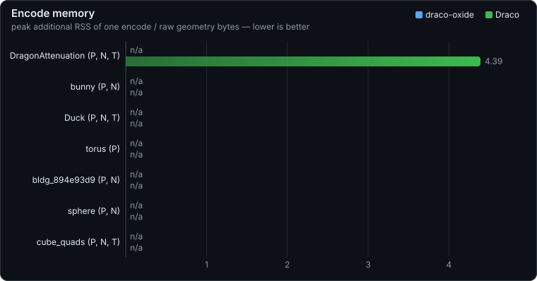
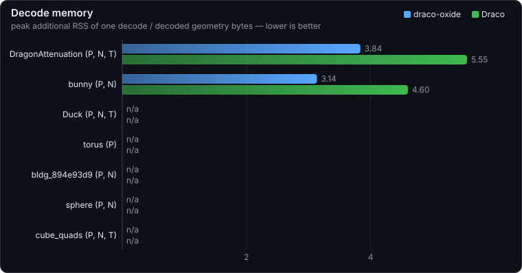

# Benchmark

Benchmark of draco-oxide against Google Draco over the meshes in `tests/data`,
measuring compression ratio, encode/decode speed, and memory use. Each run
renders SVG charts into `assets/` and splices the report into this README,
below the [Method](#method) section.

## How to run it

```bash
scripts/build-draco.sh                    # once: build libdraco
cargo run -p bench --release
```

`scripts/build-draco.sh` builds the Google Draco checkout the bench links
against; override its location with `DRACO_SRC_DIR` / `DRACO_BUILD_DIR`.

You can also benchmark your own data. Place the OBJ files in `tests/data/local`,
then

```bash
cargo run -p bench --release -- --local   # also bench OBJs in tests/data/local/
```

Currently we support OBJ format only.

## Method

The input meshes are the OBJ files in `tests/data/`, and "raw" refers to the
uncompressed geometry both codecs start from: every attribute's unique values
plus 32-bit face indices. With `--local`, the OBJ files in the git-ignored
`tests/data/local/` directory are benched as well, and the report notes such
runs.

Both codecs run in-process on in-memory data and share the same timing
harness: each measurement is the median wall time over repeated runs after a
warmup. They also run with matching settings: edgebreaker connectivity, 11-bit
positions, 10-bit texture coordinates, and 8-bit octahedral normals (Draco at
compression level 7, its CLI default).
draco-oxide encodes with `encode()` under `Config::default()` and
decodes with `decode()` back to original-format floats. Google Draco is
`libdraco` called through a C shim, encoding with `Encoder::EncodeMeshToBuffer`
under the CLI-default options and decoding with `Decoder::DecodeMeshFromBuffer`.
Each codec encodes its own parse of the same OBJ.

Speed is reported as throughput over the raw geometry size, in MB/s consumed
by the encoder and MB/s produced by the decoder (1 MB = 10^6 bytes).
Compression ratio is raw bytes divided by compressed bytes, so both codecs
share the same raw baseline.

Memory is measured for one encode and one decode of each mesh. Peak RSS is the
`VmHWM` growth of the operation in a fresh subprocess per codec, with the
kernel's high-water mark reset via `/proc/self/clear_refs` after the input OBJ
or stream has been loaded, so only what the operation itself adds counts. The
oxide heap columns come from a counting global allocator: live bytes relative
to the start of the operation, integrated over time at every allocation event.
All memory values are reported as ratios to the raw geometry size.

<!-- report:start -->
## Compression


## Speed


## Encode memory



All values are normalized by the raw geometry size (the raw KB column of the results table) and measure memory on top of the already-loaded input mesh: memory bytes per input byte. Peak RSS is measured the same way for both codecs (one encode in a fresh subprocess that has loaded the OBJ, `VmHWM` delta) and is directly comparable. The heap columns are exact allocation-event byte counts from a tracking allocator (oxide only): peak, time-weighted average, and RMS of live encode-window bytes; they exclude allocator overhead, so they read below RSS.

| mesh | oxide heap peak | oxide heap avg | oxide heap RMS | oxide peak RSS | Draco peak RSS |
|---|--:|--:|--:|--:|--:|
| DragonAttenuation (P, N, T) | 5.98 | 3.42 | 3.67 | 3.86 | 4.53 |
| bunny (P, N) | 7.43 | 4.14 | 4.57 | 7.47 | 2.26 |
| Duck (P, N, T) | 6.41 | 3.34 | 3.69 | 4.64 | 10.37 |
| torus (P) | 10.39 | 5.72 | 6.33 | 10.61 | 9.94 |
| bldg_894e93d9 (P, N) | 12.10 | 5.96 | 6.46 | 13.07 | 50.18 |
| sphere (P, N) | 16.40 | 5.80 | 7.09 | 35.49 | 108.74 |
| cube_quads (P, N, T) | 11.14 | 5.47 | 5.85 | 392.93 | 2119.44 |

## Decode memory



All values are normalized by the decoded geometry size (the raw KB column of the results table): memory bytes per output byte. Peak RSS is measured the same way for both codecs (one decode in a fresh subprocess, `VmHWM` delta) and is directly comparable. The heap columns are exact allocation-event byte counts from a tracking allocator (oxide only): peak, time-weighted average, and RMS of live decode-window bytes; they exclude allocator overhead, so they read below RSS.

| mesh | oxide heap peak | oxide heap avg | oxide heap RMS | oxide peak RSS | Draco peak RSS |
|---|--:|--:|--:|--:|--:|
| DragonAttenuation (P, N, T) | 5.15 | 3.41 | 3.68 | 5.26 | 5.53 |
| bunny (P, N) | 3.80 | 2.75 | 2.98 | 4.11 | 3.67 |
| Duck (P, N, T) | 5.45 | 3.81 | 4.13 | 8.63 | 12.93 |
| torus (P) | 3.99 | 2.79 | 3.04 | 9.50 | 16.33 |
| bldg_894e93d9 (P, N) | 9.52 | 5.73 | 6.41 | 32.67 | 64.82 |
| sphere (P, N) | 9.97 | 5.39 | 6.51 | 83.82 | 183.50 |
| cube_quads (P, N, T) | 17.44 | 8.25 | 9.60 | 988.28 | 2774.33 |

## Results

Each mesh name is annotated with the attributes it carries: P (position), N (normal), T (texture coordinate), C (color).

| mesh | faces | raw KB | oxide KB | Draco KB | oxide ratio | Draco ratio | oxide enc ms | Draco enc ms | oxide dec ms | Draco dec ms |
|---|--:|--:|--:|--:|--:|--:|--:|--:|--:|--:|
| DragonAttenuation (P, N, T) | 134995 | 4259.4 | 388.6 | 366.3 | 10.96 | 11.63 | 150 | 70.6 | 22.5 | 33.1 |
| bunny (P, N) | 69451 | 1630.3 | 65.5 | 67.5 | 24.91 | 24.14 | 48.7 | 18.9 | 4.85 | 8.52 |
| Duck (P, N, T) | 4212 | 117.3 | 10.9 | 10.1 | 10.77 | 11.60 | 2.84 | 1.48 | 0.461 | 0.728 |
| torus (P) | 4095 | 72.0 | 3.2 | 2.4 | 22.78 | 29.62 | 1.94 | 0.394 | 0.127 | 0.146 |
| bldg_894e93d9 (P, N) | 696 | 15.3 | 3.8 | 3.0 | 4.05 | 5.18 | 0.559 | 0.206 | 0.093 | 0.125 |
| sphere (P, N) | 224 | 5.3 | 1.9 | 0.7 | 2.76 | 8.01 | 0.197 | 0.090 | 0.022 | 0.044 |
| cube_quads (P, N, T) | 12 | 0.3 | 0.2 | 0.2 | 1.54 | 1.84 | 0.013 | 0.012 | 0.007 | 0.008 |

Measurement details are in the [Method](#method) section above.
<!-- report:end -->
