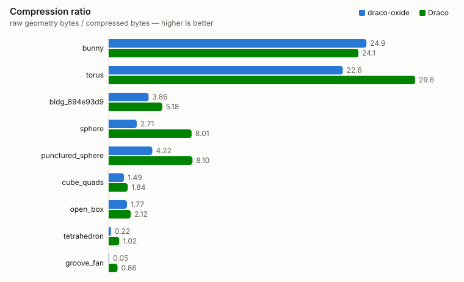
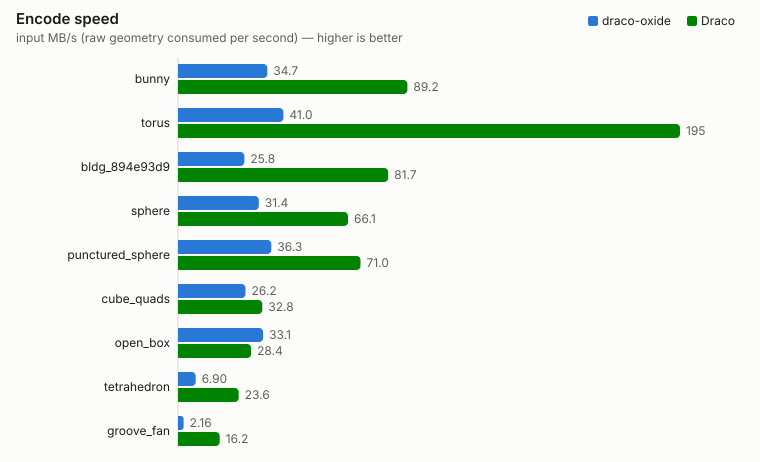
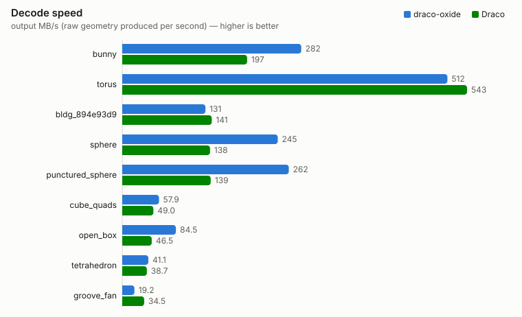

# draco-oxide vs Google Draco — benchmark

Generated by `cargo run -p bench --release` on AMD Ryzen Threadripper 7970X 32-Cores (linux).

Both codecs run in-process with the same timing harness and matching settings: edgebreaker connectivity, 11-bit positions, 10-bit texture coordinates, 8-bit octahedral normals (Draco at compression level 7, its CLI default).

## Compression

## Speed

## Results

| mesh | faces | raw KB | oxide KB | Draco KB | oxide ratio | Draco ratio | oxide enc ms | Draco enc ms | oxide dec ms | Draco dec ms |
|---|--:|--:|--:|--:|--:|--:|--:|--:|--:|--:|
| bunny | 69451 | 1630.3 | 65.4 | 67.5 | 24.91 | 24.14 | 62.1 | 18.8 | 12.2 | 8.52 |
| torus | 4095 | 72.0 | 3.2 | 2.4 | 22.63 | 29.62 | 1.86 | 0.370 | 0.387 | 0.136 |
| bldg_894e93d9 | 696 | 15.3 | 4.0 | 3.0 | 3.86 | 5.18 | 0.707 | 0.256 | 0.207 | 0.134 |
| sphere | 224 | 5.3 | 2.0 | 0.7 | 2.71 | 8.01 | 0.179 | 0.083 | 0.037 | 0.044 |
| punctured_sphere | 223 | 5.3 | 1.3 | 0.7 | 4.22 | 8.10 | 0.157 | 0.075 | 0.037 | 0.038 |
| cube_quads | 12 | 0.3 | 0.2 | 0.2 | 1.49 | 1.84 | 0.013 | 0.010 | 0.006 | 0.007 |
| open_box | 10 | 0.3 | 0.2 | 0.1 | 1.77 | 2.12 | 0.010 | 0.011 | 0.004 | 0.007 |
| tetrahedron | 4 | 0.2 | 0.8 | 0.2 | 0.22 | 1.02 | 0.031 | 0.009 | 0.005 | 0.006 |
| groove_fan | 3 | 0.1 | 2.1 | 0.1 | 0.05 | 0.86 | 0.055 | 0.007 | 0.006 | 0.004 |

## Method

- Input meshes are the OBJ files in `tests/data/`; "raw" is the uncompressed geometry both codecs start from (unique attribute values plus 32-bit face indices).
- Both codecs are timed in-process on in-memory data: median wall time over repeated runs after a warmup, same harness for both.
- draco-oxide: `encode()` with `Config::default()`; decode is `decode()` back to original-format floats.
- Google Draco: `libdraco` (the checkout built by `scripts/build-draco.sh`) called through a C shim; encode is `Encoder::EncodeMeshToBuffer` with the CLI-default options, decode is `Decoder::DecodeMeshFromBuffer`. Each codec encodes its own parse of the same OBJ.
- Speed is throughput over the raw geometry size: MB/s consumed by the encoder and MB/s produced by the decoder (1 MB = 10^6 bytes).
- Compression ratio = raw bytes / compressed bytes, same raw baseline for both codecs.
